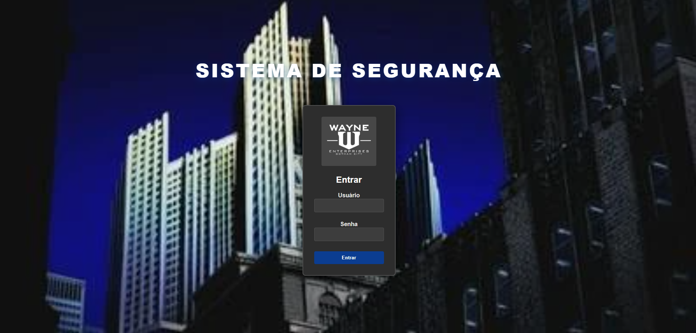

<p>
 
</p>

## 🖥️ Projeto

Esse é um Web desenvolvido no curso de Dev Fullstack da Infinity School com o professor Abelardo Junior.

# Sistema de Gerenciamento de Segurança - Indústrias Wayne

Protótipo funcional com frontend (HTML/CSS/JS) e backend (Python/Flask + SQLite).

Instalação e execução:

1. Criar um virtualenv (opcional):

```bash
python -m venv venv
venv\Scripts\activate
```

2. Criar arquivo `.env` com uma `SECRET_KEY` forte (ou usar o exemplo `.env` fornecido).

3. Instalar dependências:

```bash
pip install -r requirements.txt
```

4. Inicializar banco de dados com dados de exemplo:

```bash
python db_init.py
```

5. Executar a aplicação:

```bash
python app.py
```

6. Abrir no navegador: `http://127.0.0.1:5000`

Usuários de exemplo:
- admin / adminpass (administrador)
- manager / managerpass (gerente)
- staff / staffpass (funcionário)

Arquitetura:
- `app.py`: backend Flask serve páginas e API REST para recursos.
- `db_init.py`: inicializa `security.db` com amostras.
- `templates/`: páginas HTML.
- `static/`: CSS e JS do frontend.


## 🎨 Layout

Você pode visualizar o layout do projeto através
[desse link](https://github.com/marciliossalgado)

### 🧑‍💻 Creditos

Projeto foi feito em casa para projetos de aula na [Infinity School](https://infinityschool.com.br/).

Professor (Abelardo Junior).
